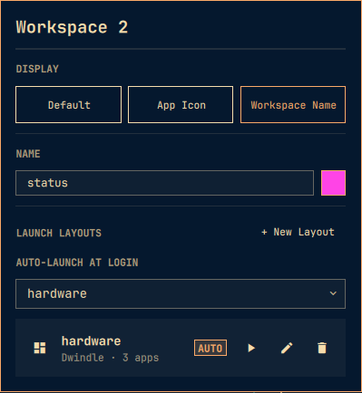

# Workspace Display

Workspace Display enhances Omarchy's default workspace styling and display
with app icons, names, colours, and a compact scratchpad indicator.

It targets Omarchy Quattro with Hyprland and Quickshell. It is not a workspace
creation or layout manager.



## Install

```bash
omarchy plugin add https://github.com/reggieaalbios/omarchy-workspace-display.git --enable
```

## Update, disable, and remove

```bash
omarchy plugin update io.github.reggieaalbios.workspace-display
omarchy plugin disable io.github.reggieaalbios.workspace-display
omarchy plugin remove io.github.reggieaalbios.workspace-display
```

## Controls

- Left-click a workspace to switch to it.
- Right-click a workspace to open its display editor.
- Click the scratchpad indicator to toggle the scratchpad.

## Keybindings

The plugin does not change Hyprland bindings when it is installed. To open the
editor for workspaces 1 through 10 with `SUPER + CTRL + ALT + 1…0`, add the
following to `~/.config/hypr/bindings.lua`:

```lua
-- Warning: these bindings replace any existing SUPER + CTRL + ALT + 1…0 bindings.
for workspace = 1, 10 do
  local key = "code:" .. tostring(workspace + 9)
  hl.unbind("SUPER + CTRL + ALT + " .. key)
  o.bind("SUPER + CTRL + ALT + " .. key,
    "Workspace " .. workspace .. " display settings",
    "omarchy-shell io.github.reggieaalbios.workspace-display.settings picker " .. workspace)
end
```

Run `hyprctl reload` after changing your bindings.

## Data and attribution

Workspace presentation metadata is stored in
`~/.config/omarchy/workspace-manager.json`. The plugin writes only values that
differ from its defaults through Quickshell's atomic `FileView` path. It does
not read or modify Decent Workspaces data.

This project was derived from [Decent Workspaces](https://github.com/TheTrueFerret/omarchy-decent-workspaces-plugin). Its MIT copyright notice is retained in [LICENSE](LICENSE), alongside the copyright for this project.
